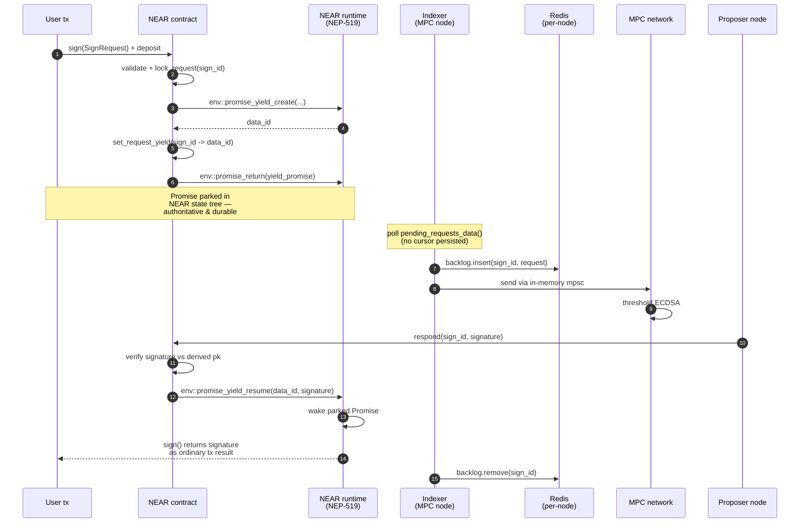
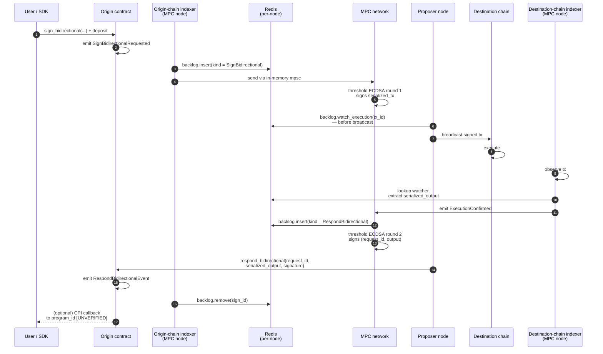

# §2 — Architecture overview

[← §1 TL;DR](01-tldr.md) · [Index](README.md) · Next: [§3 Key files →](03-key-files.md)

---

## 2.1 Components

| Component | What it is | Where in repo |
|---|---|---|
| **MPC node** | Long-running Rust process that holds a key share, runs the threshold protocol, runs indexers, and calls `respond()` back on-chain. | [chain-signatures/node/](../../chain-signatures/node/) |
| **NEAR orchestrating contract** | Source of truth for the network itself (membership, config, key versions) **and** the NEAR signing contract. Yield/resume-based. | [chain-signatures/contract/](../../chain-signatures/contract/) |
| **Ethereum signing contract** | Solidity. `sign()` emits `SignatureRequested`; `respond()` emits `SignatureResponded`. Pure event plumbing. | [chain-signatures/contract-eth/contracts/ChainSignatures.sol](../../chain-signatures/contract-eth/contracts/ChainSignatures.sol) |
| **Solana signing program** | Anchor. Same `sign`/`respond` shape, plus `sign_bidirectional`/`respond_bidirectional` for the callback pattern. | [chain-signatures/contract-sol/src/lib.rs](../../chain-signatures/contract-sol/src/lib.rs) |
| **Hydration pallet** | Substrate pallet on Hydration emits `Signet::SignatureRequested`/`Responded`. | (runtime external; indexer at [chain-signatures/node/src/indexer_hydration.rs](../../chain-signatures/node/src/indexer_hydration.rs)) |
| **Per-chain indexers** | Embedded in the node. One per chain. Detect events, validate, normalize to `IndexedSignRequest`. | [indexer.rs](../../chain-signatures/node/src/indexer.rs) (NEAR), [indexer_eth/](../../chain-signatures/node/src/indexer_eth/), [indexer_sol.rs](../../chain-signatures/node/src/indexer_sol.rs), [indexer_hydration.rs](../../chain-signatures/node/src/indexer_hydration.rs) |
| **cait-sith library** | External crate — threshold ECDSA engine. The node calls it; you shouldn't need to read it. | external dep |
| **Redis** | Local node-scoped storage for triples, presignatures, sync checkpoints. | required at runtime |
| **GCP Secret Manager** | Stores each node's secret key share in production. Local runs use a file. | required at runtime for prod |

Threshold and cohort are determined by the NEAR contract's `ProtocolContractState` ([chain-signatures/contract/src/lib.rs](../../chain-signatures/contract/src/lib.rs)); the non-NEAR contracts carry **no membership state** — they are pure plumbing that anyone may call `respond()` on ([ChainSignatures.sol:69-78](../../chain-signatures/contract-eth/contracts/ChainSignatures.sol#L69-L78) — "Any address can emit this event. Clients should always verify the validity of the signature").

## 2.2 Data-flow diagrams

The network supports **three distinct flows**. They share the same threshold-signing core but differ in how the request is framed and how the result is delivered. Your mental model should include all three — not just the event-based default, because the others materially change SDK shape.

Cross-reference to the capability matrix in [§1](01-tldr.md#what-it-lets-you-do-per-chain).

**A note on Redis in these diagrams.** Each MPC node runs its own Redis ([cli.rs](../../chain-signatures/node/src/cli.rs)). Redis holds the backlog (in-flight sign requests), indexer checkpoints, execution watchers for bidirectional flows, and the triple/presignature stockpile. It is shown as a participant on every flow below because it's the **boundary between "survives a node crash" and "lost on a crash"** — and because honest node crashes are the most common failure mode you need to reason about as an integrator. The in-memory `mpsc` channel between indexer and protocol is *not* shown as a participant because it is not durable; think of it as a wire between the Redis node and the MPC-network node. Liveness consequences of this layout are in [§10](10-potential-risks.md).

### Flow A — Event-based async (default)

**Chains: Ethereum, Solana (`sign`/`respond`), Hydration (`SignatureRequested`/`Responded`).** The lowest-common-denominator shape. Integrator writes an off-chain listener state machine.

```mermaid
sequenceDiagram
    autonumber
    participant U as User / SDK
    participant C as Signing contract
    participant IDX as Indexer<br/>(MPC node)
    participant R as Redis<br/>(per-node)
    participant NET as MPC network<br/>(≥threshold nodes)
    participant PR as Proposer node

    U->>C: sign(payload, path, key_version, ...)<br/>+ deposit
    C->>C: emit SignatureRequested(...)
    Note over IDX: poll / subscribe / proof
    C-->>IDX: event observed
    IDX->>IDX: validate + build IndexedSignRequest
    IDX->>R: backlog.insert(sign_id, request)
    Note right of R: durable (if AOF/RDB on);<br/>replay on restart
    IDX->>NET: send via in-memory mpsc
    NET->>NET: threshold ECDSA<br/>(cait-sith)
    NET->>PR: FullSignature { big_r, s }
    Note over PR: signature only in RAM<br/>until published
    PR->>PR: verify signature vs derived pk
    PR->>C: respond(request_id, signature)
    C->>C: emit SignatureResponded(request_id, ...)
    IDX->>R: on response observed,<br/>backlog.remove(sign_id)
    C-->>U: listener matches request_id<br/>SDK verifies signature client-side
    Note over R: indexer checkpoint<br/>(last_processed_block)<br/>written after block drained
```

Note the client-side verification step. On Ethereum and Solana, `respond()` is permissionless — anyone can emit a `SignatureResponded` event with any bytes. Your SDK **must** verify the signature against the derived public key before trusting it ([ChainSignatures.sol:69-78](../../chain-signatures/contract-eth/contracts/ChainSignatures.sol#L69-L78)). Also note the two "in-RAM only" gaps: the mpsc channel between indexer and protocol, and the computed signature on the proposer. Both are points where an honest crash can drop the request — details in [§10.6](10-potential-risks.md#106-indexer-delivery-guarantees--what-survives-a-crash) and [§10.7](10-potential-risks.md#107-the-computed-signature-in-ram-gap).

### Flow B — NEAR yield/resume (sync-feel)

**Chain: NEAR only.** The runtime itself parks the caller's tx until `respond()` arrives. No event listening. No `request_id` bookkeeping. `sign()` looks like an ordinary function call that happens to take a few seconds.



Mechanics detailed in [§4.2 — NEP-519](04-event-flow.md#nears-on-chain-yieldresume-primitive-nep-519). Note that unlike Flow A, **the contract itself verifies the signature** ([contract/src/lib.rs:278-286](../../chain-signatures/contract/src/lib.rs#L278-L286)) before resuming — so the caller can trust the result without further checks.

NEAR is unusually resilient here because the pending-request list lives in the **NEAR contract state**, not just in MPC-node Redis. If a node loses its Redis or restarts, the next poll of `pending_requests_data()` rehydrates the backlog from authoritative on-chain state. The cost: completed-while-down requests are invisible on restart because they're no longer in the pending list ([§10.6](10-potential-risks.md#106-indexer-delivery-guarantees--what-survives-a-crash)).

### Flow C — Bi-directional cross-chain (sign + broadcast + respond)

**Chains: Solana, Hydration.** The origin-chain call actually executes a transaction on a **different chain** as a side-effect, and returns the destination-chain execution result. Transforms "sign my cross-chain tx" into "do my cross-chain operation."



Three things that are easy to miss:

1. **Two separate threshold-signing rounds.** Round 1 signs the destination-chain tx; round 2 signs `(request_id, serialized_output)` so the origin contract can verify that the output really came from the network, not an attacker calling `respond_bidirectional` with forged bytes. See [respond_bidirectional.rs:86-128](../../chain-signatures/node/src/respond_bidirectional.rs#L86-L128) — the output is packaged as a fresh `IndexedSignRequest` with `kind = RespondBidirectional` and routed back through the sign queue.
2. **The destination-chain indexer is a required participant.** The proposer does *not* wait synchronously on the broadcast — it broadcasts, then a destination-chain indexer (running on some MPC node) detects the included tx and emits `ChainEvent::ExecutionConfirmed` ([indexer_eth/mod.rs:1102](../../chain-signatures/node/src/indexer_eth/mod.rs#L1102), [stream/mod.rs:41](../../chain-signatures/node/src/stream/mod.rs#L41)). If that indexer misses the tx, the flow stalls even though the destination tx executed successfully. If the destination chain is **Solana**, the destination indexer has no persistence and no catchup ([§10.6](10-potential-risks.md#106-indexer-delivery-guarantees--what-survives-a-crash)) — a brief node outage can silently drop the confirmation.
3. **Redis mediates state across four async boundaries in this flow.** Inserting the round-1 request, registering the execution watcher before broadcast, hydrating the watcher on the destination side, inserting the round-2 request. Any of these writes that doesn't make it to durable storage is a potential drop point. The crash windows are discussed in [§10.5](10-potential-risks.md#105-flow-specific-risk-compounding) and [§10.6](10-potential-risks.md#106-indexer-delivery-guarantees--what-survives-a-crash).

Source of truth: [contract-sol/src/lib.rs:90-119](../../chain-signatures/contract-sol/src/lib.rs#L90-L119), [respond_bidirectional.rs](../../chain-signatures/node/src/respond_bidirectional.rs), [sign_bidirectional.rs](../../chain-signatures/node/src/sign_bidirectional.rs). The `caip2_id` parameter tells the network which destination chain to broadcast to. The `program_id` (Solana) looks like it should identify a caller contract to dispatch the result into, but **the current `respond_bidirectional` handler doesn't CPI into it** — it just emits an event. See [§10.9](10-potential-risks.md#109-bidirectional-responses-dont-actually-invoke-the-caller).

**Liveness implications of this flow are significant — see [§10 Potential risks](10-potential-risks.md).**

### What's out of scope in these diagrams

The MPC network's internal node-to-node message protocol is **out of scope** for integrators — see [doc/mpc_node_specification.md](../mpc_node_specification.md) if you need to reason about node-level behaviour. For integrators, the surface area you touch is: the `sign*` call at the start, the contract-side validation, the indexer observe step, and the `respond*` call at the end.

## 2.3 How the pieces communicate

- **User ↔ chain**: normal chain transaction + event stream. Off-chain you compute a `request_id` hash and listen for `SignatureResponded` with that id (except on NEAR, where you just `.await` the Promise). Request-id encoding is `keccak256(abi_encode(sender, payload, path, key_version, chain_id, algo, dest, params))` across chains — see [indexer_sol.rs:146-162](../../chain-signatures/node/src/indexer_sol.rs#L146-L162). More in [§4.1](04-event-flow.md#41-what-a-signaturerequested-event-actually-contains).
- **Indexer ↔ MPC core**: all chains produce the same `ChainEvent` enum and drain through the same stream. See [chain-signatures/node/src/stream/mod.rs](../../chain-signatures/node/src/stream/mod.rs) + [stream/ops.rs](../../chain-signatures/node/src/stream/ops.rs). More in [§5.1](05-indexers.md#51-shared-shape).
- **Node ↔ node**: HPKE-encrypted CBOR over HTTP `POST /msg` and `POST /sync` ([web/mod.rs:86-92](../../chain-signatures/node/src/web/mod.rs#L86-L92)). You will not integrate against these.
- **Node ↔ Redis**: triple, presignature, backlog, and checkpoint storage. Nothing external to worry about — but without Redis the node will not start ([cli.rs](../../chain-signatures/node/src/cli.rs)).

Canonical architecture doc: [doc/ARCHITECTURE.md](../ARCHITECTURE.md) for the official view of the same picture.

---

[← §1 TL;DR](01-tldr.md) · [Index](README.md) · Next: [§3 Key files →](03-key-files.md)
