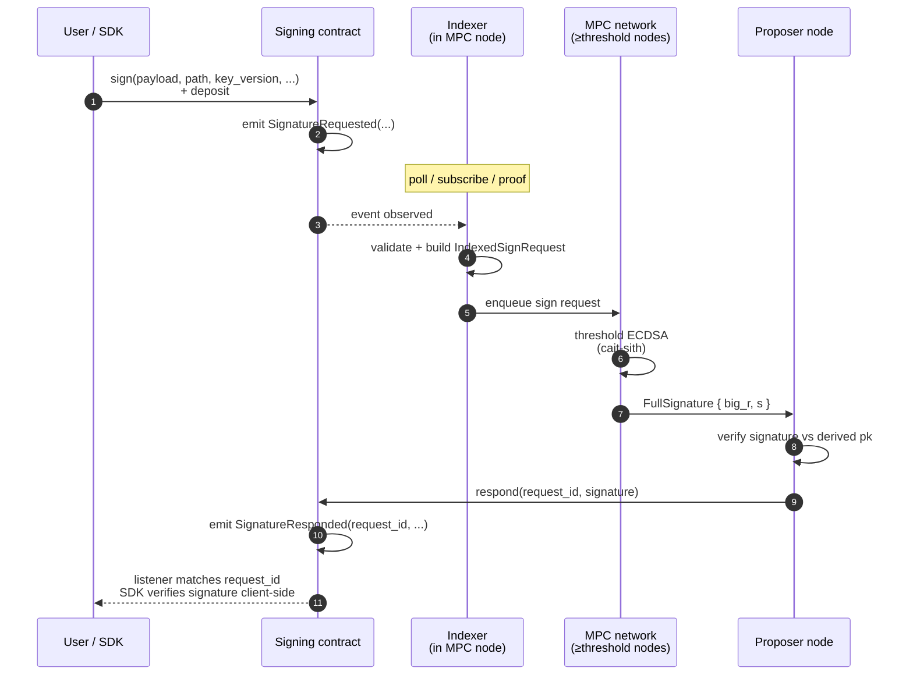
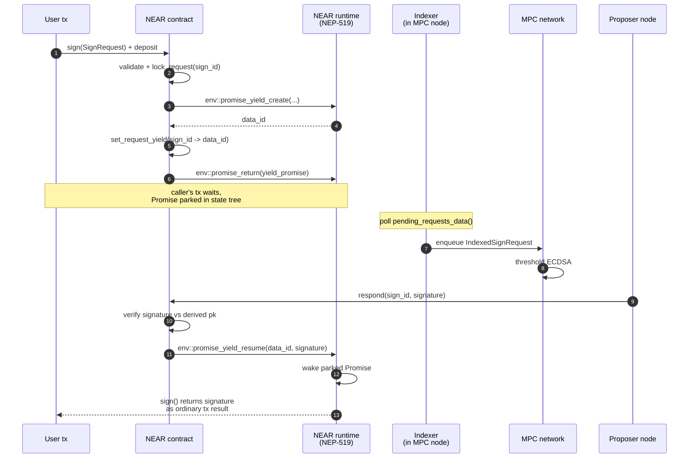
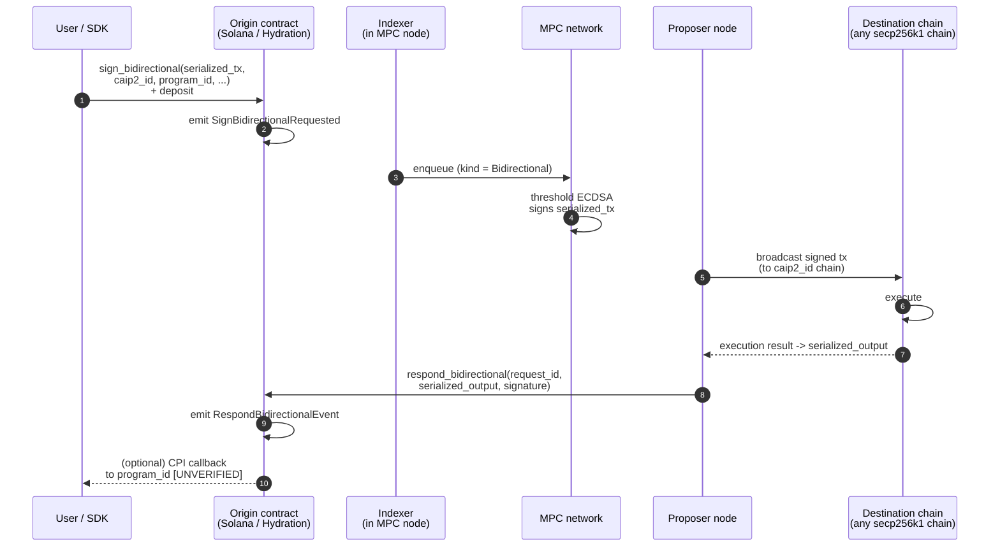

# §2 — Architecture overview

[← §1 TL;DR](01-tldr.md) · [Index](README.md) · Next: [§3 Key files →](03-key-files.md)

---

## 2.1 Components

| Component | What it is | Where in repo |
|---|---|---|
| **MPC node** | Long-running Rust process that holds a key share, runs the threshold protocol, runs indexers, and calls `respond()` back on-chain. | [chain-signatures/node/](../../chain-signatures/node/) |
| **NEAR orchestrating contract** | Source of truth for the network itself (membership, config, key versions) **and** the NEAR signing contract. Yield/resume-based. | [chain-signatures/contract/](../../chain-signatures/contract/) |
| **Ethereum signing contract** | Solidity. `sign()` emits `SignatureRequested`; `respond()` emits `SignatureResponded`. Pure event plumbing. | [chain-signatures/contract-eth/contracts/ChainSignatures.sol](../../chain-signatures/contract-eth/contracts/ChainSignatures.sol) |
| **Solana signing program** | Anchor. Same `sign`/`respond` shape, plus `sign_bidirectional`/`respond_bidirectional` for the callback pattern. | [chain-signatures/contract-sol/src/lib.rs](../../chain-signatures/contract-sol/src/lib.rs) |
| **Hydration pallet** | Substrate pallet on Hydration emits `Signet::SignatureRequested`/`Responded`. | (runtime external; indexer at [chain-signatures/node/src/indexer_hydration.rs](../../chain-signatures/node/src/indexer_hydration.rs)) |
| **Per-chain indexers** | Embedded in the node. One per chain. Detect events, validate, normalize to `IndexedSignRequest`. | [indexer.rs](../../chain-signatures/node/src/indexer.rs) (NEAR), [indexer_eth/](../../chain-signatures/node/src/indexer_eth/), [indexer_sol.rs](../../chain-signatures/node/src/indexer_sol.rs), [indexer_hydration.rs](../../chain-signatures/node/src/indexer_hydration.rs) |
| **cait-sith library** | External crate — threshold ECDSA engine. The node calls it; you shouldn't need to read it. | external dep |
| **Redis** | Local node-scoped storage for triples, presignatures, sync checkpoints. | required at runtime |
| **GCP Secret Manager** | Stores each node's secret key share in production. Local runs use a file. | required at runtime for prod |

Threshold and cohort are determined by the NEAR contract's `ProtocolContractState` ([chain-signatures/contract/src/lib.rs](../../chain-signatures/contract/src/lib.rs)); the non-NEAR contracts carry **no membership state** — they are pure plumbing that anyone may call `respond()` on ([ChainSignatures.sol:69-78](../../chain-signatures/contract-eth/contracts/ChainSignatures.sol#L69-L78) — "Any address can emit this event. Clients should always verify the validity of the signature").

## 2.2 Data-flow diagrams

The network supports **three distinct flows**. They share the same threshold-signing core but differ in how the request is framed and how the result is delivered. Your mental model should include all three — not just the event-based default, because the others materially change SDK shape.

Cross-reference to the capability matrix in [§1](01-tldr.md#what-it-lets-you-do-per-chain).

### Flow A — Event-based async (default)

**Chains: Ethereum, Solana (`sign`/`respond`), Hydration (`SignatureRequested`/`Responded`).** The lowest-common-denominator shape. Integrator writes an off-chain listener state machine.

Note the client-side verification step (bottom). On Ethereum and Solana, `respond()` is permissionless — anyone can emit a `SignatureResponded` event with any bytes. Your SDK **must** verify the signature against the derived public key before trusting it ([ChainSignatures.sol:69-78](../../chain-signatures/contract-eth/contracts/ChainSignatures.sol#L69-L78)).

### Flow B — NEAR yield/resume (sync-feel)

**Chain: NEAR only.** The runtime itself parks the caller's tx until `respond()` arrives. No event listening. No `request_id` bookkeeping. `sign()` looks like an ordinary function call that happens to take a few seconds.

Mechanics detailed in [§4.2 — NEP-519](04-event-flow.md#nears-on-chain-yieldresume-primitive-nep-519). Note that unlike Flow A, **the contract itself verifies the signature** ([contract/src/lib.rs:278-286](../../chain-signatures/contract/src/lib.rs#L278-L286)) before resuming — so the caller can trust the result without further checks.

### Flow C — Bi-directional cross-chain (sign + broadcast + respond)

**Chains: Solana, Hydration.** The origin-chain call actually executes a transaction on a **different chain** as a side-effect, and returns the destination-chain execution result. Transforms "sign my cross-chain tx" into "do my cross-chain operation."

Source of truth: [contract-sol/src/lib.rs:90-119](../../chain-signatures/contract-sol/src/lib.rs#L90-L119) and [respond_bidirectional.rs](../../chain-signatures/node/src/respond_bidirectional.rs) + [sign_bidirectional.rs](../../chain-signatures/node/src/sign_bidirectional.rs). The `caip2_id` parameter is what makes this cross-chain: it tells the MPC network **which** destination chain to broadcast to. The `program_id` (Solana) is the contract to call back on the origin once the destination result is in — exact CPI invocation is `[UNVERIFIED]` (I didn't trace the final dispatch).

### What's out of scope in these diagrams

The MPC network's internal node-to-node message protocol is **out of scope** for integrators — see [doc/mpc_node_specification.md](../mpc_node_specification.md) if you need to reason about node-level behaviour. For integrators, the surface area you touch is: the `sign*` call at the start, the contract-side validation, the indexer observe step, and the `respond*` call at the end.

## 2.3 How the pieces communicate

- **User ↔ chain**: normal chain transaction + event stream. Off-chain you compute a `request_id` hash and listen for `SignatureResponded` with that id (except on NEAR, where you just `.await` the Promise). Request-id encoding is `keccak256(abi_encode(sender, payload, path, key_version, chain_id, algo, dest, params))` across chains — see [indexer_sol.rs:146-162](../../chain-signatures/node/src/indexer_sol.rs#L146-L162). More in [§4.1](04-event-flow.md#41-what-a-signaturerequested-event-actually-contains).
- **Indexer ↔ MPC core**: all chains produce the same `ChainEvent` enum and drain through the same stream. See [chain-signatures/node/src/stream/mod.rs](../../chain-signatures/node/src/stream/mod.rs) + [stream/ops.rs](../../chain-signatures/node/src/stream/ops.rs). More in [§5.1](05-indexers.md#51-shared-shape).
- **Node ↔ node**: HPKE-encrypted CBOR over HTTP `POST /msg` and `POST /sync` ([web/mod.rs:86-92](../../chain-signatures/node/src/web/mod.rs#L86-L92)). You will not integrate against these.
- **Node ↔ Redis**: triple, presignature, backlog, and checkpoint storage. Nothing external to worry about — but without Redis the node will not start ([cli.rs](../../chain-signatures/node/src/cli.rs)).

Canonical architecture doc: [doc/ARCHITECTURE.md](../ARCHITECTURE.md) for the official view of the same picture.

---

[← §1 TL;DR](01-tldr.md) · [Index](README.md) · Next: [§3 Key files →](03-key-files.md)
